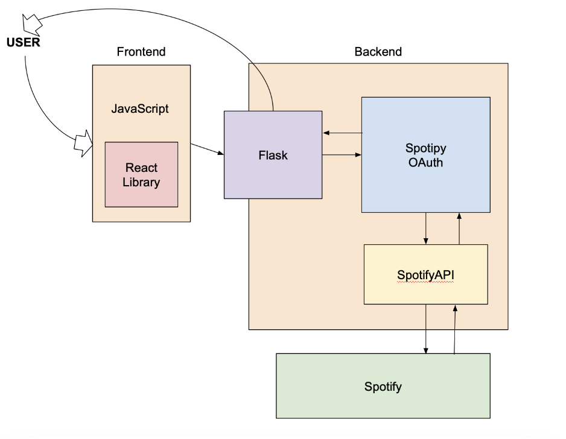

# Spotify Spotter

## Introduction
We have created an application that allows users to login with their Spotify account and access their listening stats all year-round. 

Users are also able to… 
- View global top charts
- View their top artists, songs, and genres 
- Create customized playlists based on their listening history and patterns

While the widely popular Spotify Wrapped allows users to access their stats every year at the beginning of December, our application allows users to access this data whenever they want it. 

## Technical Architecture


**Backend**: 
Uses the Flask framework. When a user makes request, triggers a request in the corresponding Flask route allowing the backend to compile a response and send it to the user. 
Functionalities include caching, authenticating users using Spotify, and fetching listening data. 

**Frontend**: 
uses the React library and JavaScript. Has a dynamic user interface. 
Four different pages including a homepage, login page, user data page, and global charts page. 


## Developers
- **Stevan Dabizljevic**: Backend
- **Ken Sterzinger**: Backend
- **Antonio Estrada**: Frontend
- **Chloe Bote**: Frontend

## Requirements
To run this project, you need Python 3.7+ and the following dependencies:
- Flask
- spotipy
- os (built-in library for handling environment variables)

You can install the required dependencies using `pip`.

## Installation

### 1. Clone the repository
```bash
git clone <(https://github.com/CS222-UIUC/main-project-group90)>
cd <main-project-group90>
```
### 2. Set up virtual environment
#### For Unix-based systems (Linux/macOS)
```bash
python3 -m venv venv
source venv/bin/activate
```
#### For Windows
```bash
python -m venv venv
.\venv\Scripts\activate
```
### 3. Install dependencies
```bash
pip install Flask spotipy
```
###  4. Configure Spotify API credentials
You will need to create your own Spotify Developer credentials.
1. Go to Spotify Developer Dashboard
2. Log in to your Spotify account
3. Create a new Spotify application to obtain the CLIENT_ID, CLIENT_SECRET, and set the REDIRECT_URI for your application.

### 5. Run the Flask Application
Now that everything is set up, you can run the Flask application:
```bash
python app.py
```
